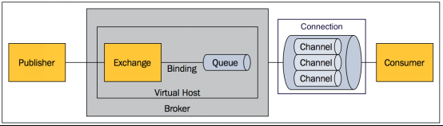

# Spring Boot与消息

* 当消息发送者发送消息以后，将由消息代理接管，消息代理保证消息传递到指定目的地
* 消息队列主要有两种形式的目的地：队列（点对点消息通信），主题（发布/订阅消息通信）

## RabbitMQ简介

* Message：消息
    * 消息是不具名的，它由消息头和消息体组成
    * 消息体是不透明的，而消息头则由一系列的可选属性组成，这些属性包括routing-key（路由键）、priority（相对于其他消息的优先权）、delivery-mode（指出该消息可能需要持久性存储）等
* Publisher：消息的生产者，也是一个向交换器发布消息的客户端应用程序
* Exchange：交换器
    * 用来接收生产者发送的消息并将这些消息路由给服务器中的队列
    * Exchange有4种类型：direct(默认)，fanout, topic, 和headers，不同类型的Exchange转发消息的策略有所区别
* Queue：消息队列
    * 用来保存消息直到发送给消费者
    * 它是消息的容器，也是消息的终点一个消息
    * 可投入一个或多个队列。消息一直在队列里面，等待消费者连接到这个队列将其取走
* Binding：绑定
    * 用于消息队列和交换器之间的关联
    * 一个绑定就是基于路由键将交换器和消息队列连接起来的路由规则，所以可以将交换器理解成一个由绑定构成的路由表
    * Exchange和Queue的绑定可以是多对多的关系
* Connection：网络连接，比如一个TCP连接
* Channel 信道
    * 多路复用连接中的一条独立的双向数据流通道
    * 信道是建立在真实的TCP连接内的虚拟连接，AMQP命令都是通过信道发出去的，不管是发布消息、订阅队列还是接收消息，这些动作都是通过信道完成
    * 因为对于操作系统来说建立和销毁TCP都是非常昂贵的开销，所以引入了信道的概念，以复用一条 TCP 连接
* Consumer：消息的消费者，表示一个从消息队列中取得消息的客户端应用程序
* Virtual Host：虚拟主机
    * 表示多个交换器、消息队列和相关对象
    * 虚拟主机是共享相同的身份认证和加密环境的独立服务器域
    * 每个vhost本质上就是一个mini版的RabbitMQ服务器，拥有自己的队列、交换器、绑定和权限机制
    * vhost是 AMQP 概念的基础，必须在连接时指定， RabbitMQ 默认的 vhost 是 /
* Broker：表示消息队列服务器实体



### Exchange 类型

* Exchange分发消息时根据类型的不同分发策略有区别，目前共四种类型：direct、fanout、topic、headers 。
* headers交换器
    * 匹配AMQP消息的header而不是路由键
    * headers交换器和direct交换器完全一致，但性能差很多，目前几乎用不到了
* direct交换器
    * 消息中的路由键（routing key）如果和Binding中的binding key一致，交换器就将消息发到对应的队列中
    * 路由键与队列名完全匹配，如果一个队列绑定到交换机要求路由键为 "dog"，则只转发routing key标记为"dog"的消息，不会转发"dog.puppy"，也不会转发"dog.guard"等
    * 它是完全匹配、单播的模式
* fanout交换器
    * 每个发到fanout类型交换器的消息都会分到所有绑定的队列上去
    * fanout交换器不处理路由键，只是简单的将队列绑定到交换器上，每个发送到交换器的消息都会被转发到与该交换器绑定的所有队列上
    * fanout类型转发消息是最快的
* topic交换器
    * 通过模式匹配分配消息的路由键属性，将路由键和某个模式进行匹配，此时队列需要绑定到一个模式上
    * 它将路由键和绑定键的字符串切分成单词，这些单词之间用点隔开
    * 它同样也会识别两个通配符：符号"#"和符号"*"。 #匹配0个或多个单词， *匹配一个单词

## 安装测试RabbitMQ

* 安装MQ之前需要安装[erlang](https://www.erlang.org/downloads)
* 下载并安装[MQ](https://www.rabbitmq.com/download.html)
* cmd进入MQ安装目录中sbin目录，执行rabbitmq-plugins enable rabbitmq_management命令
* 浏览器输入：http://localhost:15672/，账号guest，密码guest，进入MQ页面

#### 测试

* 新建三种类型交换器：exchange.direct、exchange.fanout、exchange.topic
* 新建四个队列：atguigu、atguigu.news、atguigu.emps、gulixueyuan.news
* 新建绑定
* 发送消息测试
    * 使用exchange.direct发送消息，由于是点对点的，只有匹配上路由键的队列接收到消息
    * 使用exchange.fanout发送消息，无论设置的路由键是什么，所有绑定的队列都可以收到消息
    * 使用exchange.topic发送消息，消息的路由键可以匹配上的队列得到消息


## 程序整合

* 引入spring-boot-starter-amqp

```xml
<!--RabbitMQ-->
<dependency>
    <groupId>org.springframework.boot</groupId>
    <artifactId>spring-boot-starter-amqp</artifactId>
</dependency>
```

* application.properties配置

```properties
spring.rabbitmq.host=127.0.0.1
spring.rabbitmq.username=guest
spring.rabbitmq.password=guest
```

* 在主程序上添加注解@EnableRabbit开启基于注解的RabbitMQ模式
* 自动配置类：RabbitAutoConfiguration
* 注入了rabbitConnectionFactory连接工厂
* RabbitProperties封装了 RabbitMQ的配置
* RabbitTemplate：给RabbitMQ发送和接受消息
* AmqpAdmin ： RabbitMQ系统管理功能组件，创建和删除 Queue，Exchange，Binding
* @RabbitListener 监听消息队列的内容
