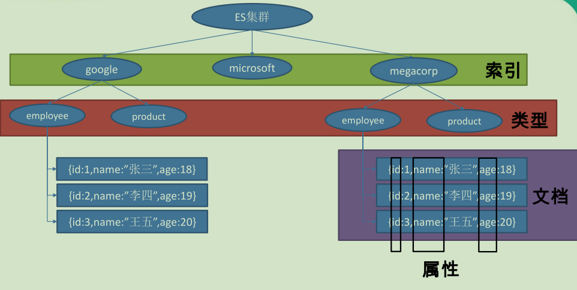

# Spring Boot与检索

## ElasticSearch

* Elasticsearch是一个分布式搜索服务，提供Restful API，底层基于Lucene，采用多shard（分片）的方式保证数据安全，并且提供自动resharding的功能
* 一个**ElasticSearch集群**可以包含多个**索引**，相应的每个索引可以包含多个**类型**，这些不同的类型存储着多个**文档**，每个文档又有多个**属性**
* 索引=数据库，类型=表，文档=表中的记录，属性=列



### 安装ElasticSearch

* [下载地址](https://elasticsearch.cn/download/)
* 安装完成之后，进入bin文件夹，双击执行elasticsearch.bat
* 浏览器访问http://localhost:9200/，显示下面JSON信息，表示安装启动成功
* 安装服务：cmd到bin目录下，执行elasticsearch-service.bat install
* [文档1](https://blog.didispace.com/books/elasticsearch-definitive-guide-cn/)

```json
{
  "name": "LAPTOP-CPNGIMNI",
  "cluster_name": "elasticsearch",
  "cluster_uuid": "y9UHXu4yTJeai6uN2DjGrg",
  "version": {
    "number": "7.10.2",
    "build_flavor": "default",
    "build_type": "zip",
    "build_hash": "747e1cc71def077253878a59143c1f785afa92b9",
    "build_date": "2021-01-13T00:42:12.435326Z",
    "build_snapshot": false,
    "lucene_version": "8.7.0",
    "minimum_wire_compatibility_version": "6.8.0",
    "minimum_index_compatibility_version": "6.0.0-beta1"
  },
  "tagline": "You Know, for Search"
}
```

### RestHighLevelClient

```xml

<dependencies>
    <dependency>
        <groupId>org.elasticsearch.client</groupId>
        <artifactId>elasticsearch-rest-high-level-client</artifactId>
        <version>7.10.2</version>
    </dependency>
    <!-- rest-high-level-client 依赖如下2个jar -->
    <dependency>
        <groupId>org.elasticsearch</groupId>
        <artifactId>elasticsearch</artifactId>
        <version>7.10.2</version>
    </dependency>
    <dependency>
        <groupId>org.elasticsearch.client</groupId>
        <artifactId>elasticsearch-rest-client</artifactId>
        <version>7.10.2</version>
    </dependency>
    <!--fastjson-->
    <dependency>
        <groupId>com.alibaba</groupId>
        <artifactId>fastjson</artifactId>
        <version>1.2.61</version>
    </dependency>
</dependencies>
```

### Spring Data

```xml
 <!--SpringBoot默认使用SpringData ElasticSearch模块进行操作-->
<dependency>
    <groupId>org.springframework.boot</groupId>
    <artifactId>spring-boot-starter-data-elasticsearch</artifactId>
</dependency>
```